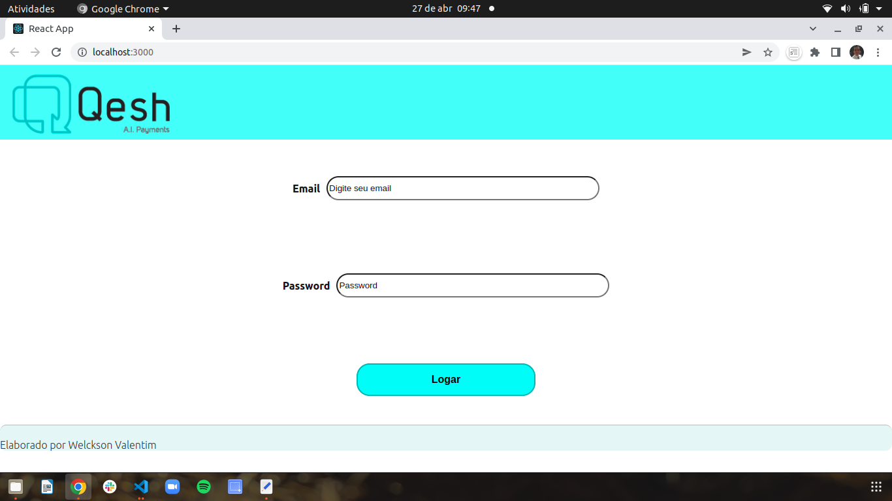

# Boas vindas ao Projeto desafio front Welckson Valentim
Este projeto renderiza a tela de login para acesso a aplicação com informações dos perfis. 

## Funcionalidades da aplicação

Esta aplicação esta em fase de desenvolvimento, sendo possível visualizar os campos de inserção do email e senha, seguidos do botão de Logar, que permitirá o acesso a tela de perfil.
Na tela de perfil temos o preenchimendo automático das informações referentes ao email utilizado no momento do login, caso o email não seja encontrado temos a exibição de mensagem de erro.

### Tecnologias utilizadas

Aplicação desenvolvida com `React.js`, `JavaScript`, `CSS`.

### Acesso ao Deploy do projeto

Realizado deploy da aplicação na plataforma Surge (em virutde do número de app do Heroku) e disponível em:
* https://desafiowelckson.surge.sh/

### Ilustração da aplicação em funcionamento

## Para rodar a aplicação localmente

1. Clone o repositório, com o comando:
    * `git clone git@github.com:welcksonvalentim/desafio-front-welckson-valentim.git`

2. Entre na pasta do repositório que você acabou de clonar:
    * `cd desafio-front-welckson-valentim`

2. Entre na sub-pasta project:
    * `cd project`

3. Instale as dependências e inicialize o projeto:
    * `npm install`

4. Inicialize o projeto:
    * `npm start`

